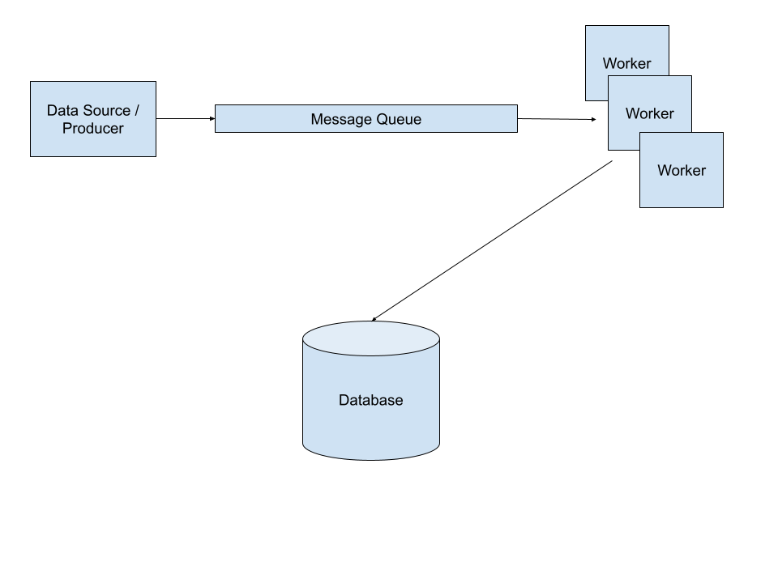

# Take home assignment

## Scaling

### System Overview

To scale this system I would implement a messaging pattern in order to decouple claim consumption from production. This decoupling allows different parts of the system to scale independently of each other to achieve the desired throughput which, in this case, is 100K claims a second. Below is a diagram of what this system could look like:



There are 4 main components to this system:

#### The Data Source / Producer

For the purposes of this question we assume that this part of the system is producing the claim data and is capable of producing 100K messages per second. We will assume that each message contains information related to a single claim.

#### Message Queue

We introduce a message queue in order to decouple message production from message consumption.

#### Worker Pool

The worker pool is a set of components that dequeue messages from the message queue and perform the needed processing of the claim data within each message. In this case, processing consists of writing the claim information contained in the message to a database.

#### Database

The database used to store the claim data.

### Performance Considerations

While there are many different technologies you can use to build a system like this I'll give some rough performance estimates based on common Amazon Web Services products that I'm familiar with:

#### Message Queue

A queue solution that I am familiar with that we could use would be Amazon SQS. SQS is highly scalable and has an upper performance bound of 120K in-flight messages per second which will satisfy our 100K message requirement.

#### Worker Pool

The solution that I am most familiar with for creating a pool of workers is Amazon Lambda. Lambda integrates easily with SQS and provides some nice out-of-the-box functionality for dequeuing, retrying and timing out messages consumed from an SQS queue. A worker pool built using Lambda/SQS has an upper performance bound of 1000 concucrrent Lambda executions. Configuring each lambda to dequeue 10 messages at a time, while handling each message in it's own thread of execution, we can reach concurrency of 10,000 threads. At an assumed round-trip latency of 50ms for a write to the database, a worker pool can handle 200K writes per second.

#### Database

Given the data model provided for claims, employees and dependents it's clear that the data is relational in nature so we would ideally use a realtional database to store this data. However, I am not aware of any relational database cloud solutions that handle 100K writes per second. Both AWS Aurora and AWS RDS advertise "high throughput" but I'm seeing that people are sturggling to get more than 40K writes per second using either solution. Knowing this we have some other options to consider:

1. Shard a relational database - By sharding the data we could logically split the data up across 3 RDS or Aurora instances which would allow for an upper performance bound of 120K writes per second. If choosing this solution we should make sure to store data that is most commonly accessed together on the same shard. Sharding by employee_id may be a good option here but I would need to more infomation on the access patterns for this data.
2. Store the data in a higher throughput non-relational database - I have experience using AWS DynamoDB which, by default, handles up to 40K writes per second but this limit can be increased well above 100K writes per second. Dynamo tables are limited to a primary and secondary index so you would lose flexibility in how you can performantly query the data in the table. A non-relational solution like MongoDB has better support for indexing but I'm not aware of any Mongo-as-a-service cloud solutions that offer 100K writes per second.

## SQL Queries

### 1. How many active employees are currently employed by Glorious Gumball?

#### query:

```sql
SELECT count(*) FROM employees
WHERE emp_end_date IS NULL OR
(emp_end_date IS NOT NULL AND emp_end_date > now());
```

#### answer:

```
4
```

#### explanation:

According to the documentation in the `tables.sql` file: "Employees that are currently active have a NULL emp_end_date". Assuming the employee is considered active until their last day on the job we then have two cases in which an employee
could be active:

1. An employee with a NULL emp_end_date
2. An employee with a non-NULL emp_end_date that occurs in the future

### 2. What are the email addresses of all active employees?

#### query:

```sql
SELECT email FROM employees
WHERE emp_end_date IS NULL OR
(emp_end_date IS NOT NULL AND emp_end_date > now());
```

#### answer:

```
+--------------------+
| email              |
+--------------------+
| jacobh@example.com |
| maryh@example.com  |
| julies@example.com |
| maryh@example.com  |
+--------------------+
```

#### explanation:

According to the documentation in the `tables.sql` file: "Employees that are currently active have a NULL emp_end_date". Assuming the employee is considered active until their last day on the job we then have two cases in which an employee
could be active:

1. An employee with a NULL emp_end_date
2. An employee with a non-NULL emp_end_date that occurs in the future

We return the email for all employees meeting the above criteria.

### 3. How many retirees, who used to be covered by Glorious Gumball, are no longer covered?

#### query:

```sql
SELECT count(*) FROM retirees WHERE term_date IS NOT NULL AND term_date < now();
```

#### answer:

```
1
```

#### explanation:

According to the documentation in the `dictionary.md` file: "Retirees that elect to discontinue their coverage under the company's plan will have a non-NULL term_date". We then have two cases in which a retiree is no longer covered:

1. term_date IS NOT NULL
2. term_date occurs in the past

### 4. How many employees have become retirees, versus how many have just dropped out of the Glorious Gumball system?

#### query:

```sql
SELECT count(*) FROM retirees;

SELECT count(*) FROM employees WHERE emp_end_date IS NOT NULL AND emp_end_date < now() AND employee_id NOT IN (
  SELECT employee_id FROM retirees
);
```

#### answer:

```
<!-- Number of retirees -->
2

<!-- Number of drop outs -->
1
```

#### explanation:

According to the documentation in the `dictionary.md` file: "Retirees that do not elect to be covered under the company's retirement plan will have no record in the retirees table". This means to find the number of "drop outs" we can simply find
the employees who have a non-NULL emp_end_date that occurs in the past and count which employees from that set do not have a
corresponding record in the retirees table.

### 5. What is the average number of dependents per employee?

#### query:

```sql
SELECT avg(dependents_by_emp_id.dependent_counts)
FROM (
  SELECT employees.employee_id, if(d_by_emp_id.d_count is null, 0, d_by_emp_id.d_count) as dependent_counts
  FROM employees
  LEFT JOIN (
    SELECT employee_id, count(dependent_id) as d_count
    FROM dependents
    GROUP BY employee_id
  ) d_by_emp_id
  ON employees.employee_id = d_by_emp_id.employee_id
) dependents_by_emp_id;
```

#### answer:

To find the answer we first need to group all records in the dependents table by employee_id and count the number of occurrences of dependent_ids. We can then join this result set to the employees table. In the event that an employee has no dependents we'll substitute a value of zero. Once we have the count of dependets for all employees we can then average the dependent_counts column to get our answer.

```
 0.1429
```

#### explanation:

### 6. How many employees have no dependents?

#### query:

```sql
SELECT count(*) FROM employees WHERE employee_id NOT IN (SELECT employee_id FROM dependents);
```

#### answer:

```
6
```

#### explanation:

We simply need to find the records from the employees table that do not correspond to any records in the dependents table.

### 7. How many claims exist with each claimant type?

#### query:

```sql
SELECT claimant_type, count(*) FROM claims GROUP BY claimant_type;
```

#### answer:

```
+---------------+----------+
| claimant_type | count(*) |
+---------------+----------+
| retiree       |        1 |
+---------------+----------+
```

#### explanation:

To get the count of claims against each claimant_type we simply need to group all records in the claims table by claimant_type and get a count of each type of record.

### 8. Generate a list of dependents and the number of claims each dependent has, for dependents with at least 10 claims in the past year

#### query:

```sql
SELECT claimant_counts.claimant_id as dependent_id, claimant_counts.claim_count
FROM (
  SELECT claimant_type, claimant_id, count(*) as claim_count
  FROM claims
  WHERE claimant_type = 'dependent' AND claim_date >= (now() - INTERVAL 12 month)
  GROUP BY claimant_id
) claimant_counts
WHERE claim_count >= 10
GROUP BY claimant_counts.claimant_id;
```

#### answer:

```
0
```

#### explanation:

In the subquery, we build a result set of claims for all dependents that have occurred within the last 12 months. In the outer query we then use that data to group the counts for each claimant by claimant_id for all claimants with a claim count
greater than or equal to 10.

### 9. Retrieve a list of all claims for the retiree with employee_id=100 (for that person only, no dependents)

#### query:

```sql
SELECT * FROM claims WHERE claimant_id = 100 AND claimant_type = 'retiree';
```

#### explanation:

According to the explanation in `dictionary.md` we know that: "If a claim is for an retiree, the claimant_type will be 'retiree' and the claimant_id will be the retiree's employee_id".

Also according to the explanation in `dictionary.md` we know that: "If a claim is for an employee, the claimant_type will be 'employee' and the claimant_id will be the employee's employee_id".

So we must query the claims table by both the claimant_id and by a claimant_type of retiree.

### 10. What is the total claim amounts per "family" (i.e. an employee/retiree and their dependents)? For this report, we only want one row per

    family, with: the employee_id as the family identifier, the employee's first and last name for reference, and the summed claim amounts

#### query:

```sql
SELECT employees.employee_id,
employees.first_name,
employees.last_name,
if(claim_totals.claim_count is null, 0, claim_totals.claim_count) as total_claims
FROM claims.employees as employees
LEFT JOIN(
  -- r4
  SELECT employee_id,
  sum(claim_count) as claim_count
  FROM(
    -- r3
    SELECT claim.claimant_id as employee_id, sum(claim.claim_amount) as claim_count
    FROM claims.claims as claim
    WHERE claimant_type != 'dependent'
    GROUP BY employee_id
    UNION ALL
    SELECT dependents.employee_id, dependent_claim.claim_count
    FROM claims.dependents as dependents
    -- r2
    LEFT JOIN(
      -- r1
      SELECT claim.claimant_id, sum(claim.claim_amount) as claim_count
      FROM claims.claims as claim
      WHERE claimant_type = 'dependent'
      GROUP BY claim.claimant_id
    ) as dependent_claim
    ON dependents.dependent_id = dependent_claim.claimant_id
  ) as claims
  GROUP BY employee_id
) as claim_totals
ON employees.employee_id = claim_totals.employee_id;
```

#### answer:

```
+--------------------------------------+------------+-----------+--------------+
| employee_id                          | first_name | last_name | total_claims |
+--------------------------------------+------------+-----------+--------------+
| 00000000-0000-0000-0000-000000000004 | Cindy      | Klaus     |            0 |
| 00000000-0000-0000-0000-000000000006 | Adam       | Adams     |       620.21 |
| 00000000-0000-0000-0000-000000000001 | Jacob      | Henry     |            0 |
| 00000000-0000-0000-0000-000000000002 | Mary       | Henry     |            0 |
| 00000000-0000-0000-0000-000000000003 | Julie      | Santa     |            0 |
| 00000000-0000-0000-0000-000000000005 | Mary       | Henry     |            0 |
| 00000000-0000-0000-0000-000000000007 | Violet     | Blue      |            0 |
+--------------------------------------+------------+-----------+--------------+
```

#### explanation

We start in the most nested subquery by building a result set of the sum of all claims, for each claimant, grouped by claimaint_id. We will call this result set "r1". We then join r1 to the dependents table to map claimaint_id to employee_id. Now we have a result
set of dependents and their total claims by employee_id. We'll call this result set "r2". We then query the claims table for all claims that are not claims for dependents and group those claims by employee_id. We'll call this result set "r3".

By unioning r2 and r3 we now have a list of all claims by employee_id.

We then sum the claim totals and group them by employee_id. We'll call this result set "r4". The summed claim value from result set in r4 is then joined to the employees table. If no value exists in r4 for a given employee_id we subsititute a value of "0" instead.

### 11. What is the total claim amount for all dependents, and what percentage is this amount out of all (summed) claims amounts?

#### query:

```sql
SELECT
  (SELECT Sum(claim_amount) FROM claims WHERE claimant_type = 'dependent') as total_for_dependents,
  (SELECT Sum(claim_amount) FROM claims WHERE claimant_type = 'dependent') /
  (SELECT Sum(claim_amount) FROM claims) as dependent_percentage_of_total;
```

#### answer:

```
+----------------------+-------------------------------+
| total_for_dependents | dependent_percentage_of_total |
+----------------------+-------------------------------+
|                    0 |                             0 |
+----------------------+-------------------------------+
```

### 12. Who is the person (employee, retiree, or dependent) with the highest number of claims, and how many claims do they have?

#### query:

```sql
SELECT employee_id,
claim_count
FROM(
  SELECT claim.claimant_id as employee_id, count(*) as claim_count
  FROM claims.claims as claim
  WHERE claimant_type != 'dependent'
  GROUP BY employee_id
  UNION ALL
  SELECT dependents.employee_id, dependent_claim.claim_count
  FROM claims.dependents as dependents
  LEFT JOIN(
    SELECT claim.claimant_id, count(*) as claim_count
    FROM claims.claims as claim
    WHERE claimant_type = 'dependent'
    GROUP BY claim.claimant_id
  ) as dependent_claim
  ON dependents.dependent_id = dependent_claim.claimant_id
) as claims
ORDER BY claim_count DESC
LIMIT 1;
```

#### answer:

```
+--------------------------------------+-------------+
| employee_id                          | claim_count |
+--------------------------------------+-------------+
| 00000000-0000-0000-0000-000000000006 |           1 |
+--------------------------------------+-------------+
```

#### explanation:

### 13. Who is the person (employee, retiree, or dependent) with the highest claim_amount in their claims, and what is that total claim_amount?

#### query:

```sql
SELECT employee_id,
sum(claim_amount) as claim_amount
FROM(
  SELECT claim.claimant_id as employee_id, sum(claim.claim_amount) as claim_amount
  FROM claims.claims as claim
  WHERE claimant_type != 'dependent'
  GROUP BY employee_id
  UNION ALL
  SELECT dependents.employee_id, dependent_claim.claim_amount
  FROM claims.dependents as dependents
  LEFT JOIN(
    SELECT claim.claimant_id, sum(claim.claim_amount) as claim_amount
    FROM claims.claims as claim
    WHERE claimant_type = 'dependent'
    GROUP BY claim.claimant_id
  ) as dependent_claim
  ON dependents.dependent_id = dependent_claim.claimant_id
) as claims
GROUP BY employee_id
ORDER BY claim_amount DESC
LIMIT 1;
```
